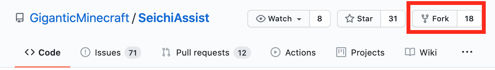
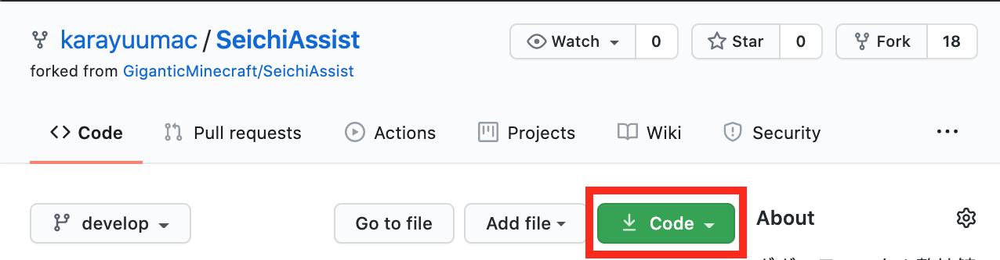
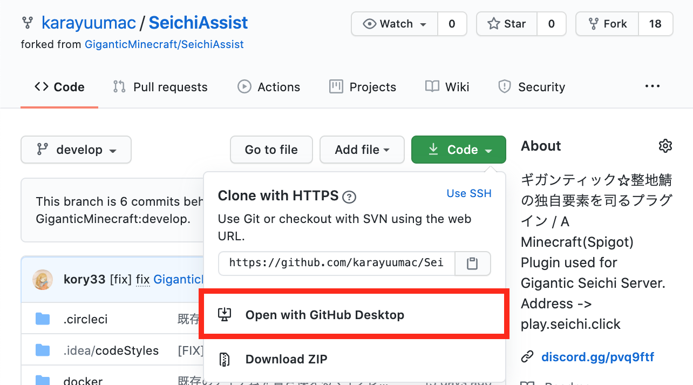
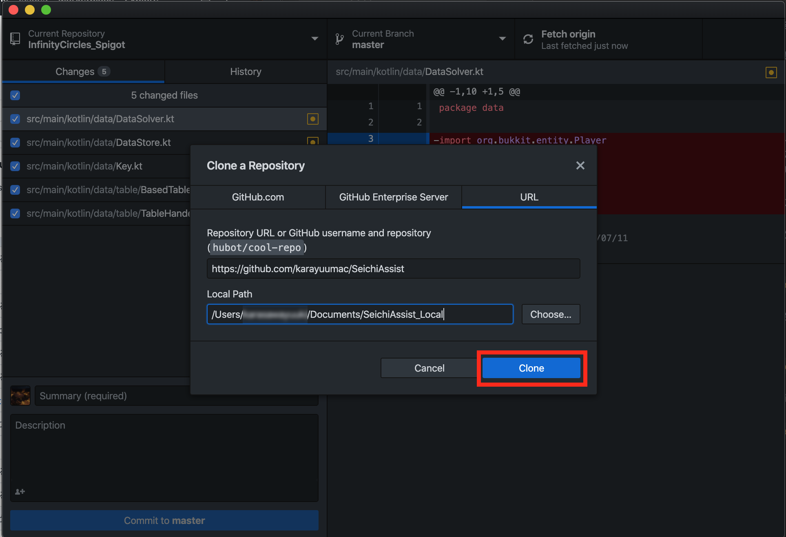
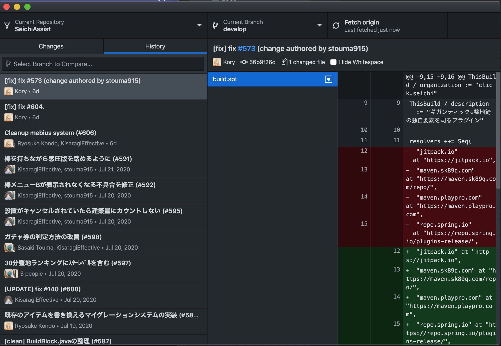
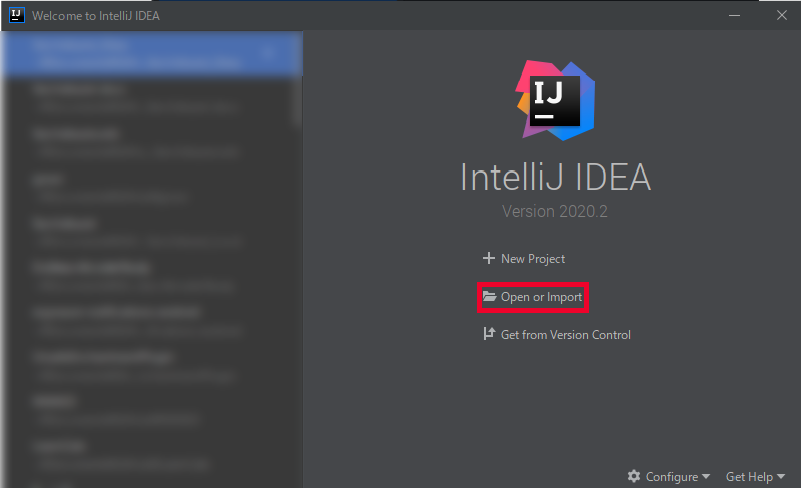

# 開発者向けガイド

このページでは、SeichiAssistの開発をお手伝いいただける方に向けて役立つ情報を掲載しています。 
初心者の方でも分かりやすいように、チュートリアル形式で説明していきますので、説明を見ながら実際に手を動かしてやってみましょう。

## 環境構築

兎にも角にも、まずは環境を整えるところから始めましょう。

#### 1. エディタのインストール

プログラミングをするには、ソースコードを編集できるソフトが必要です。
もちろん、Windowsに入っているようなメモ帳でもプログラミングはできますが、やはり専用のソフト(エディタ)を使った方がメリットが大きいです。

既に使われてるエディタがあるのならばそちらをお使いください。
この解説ではJetBrains社から出ている`IntelliJ IDEA Community Edition`を使用します。
[:fa-external-link: ここ](https://www.jetbrains.com/ja-jp/idea/download/){target=_blank} からインストールしておきましょう。

!!! Tips
    * `ソースコード`: コンピューターに対して動作をさせるための文章。
    * `エディタ`: データの作成や編集を行うことのできるソフト。このガイド内ではソースコードを編集するソフトを指す。

#### 2. Github Desktopをダウンロード

[:fa-external-link: こちら](https://desktop.github.com/){target=_blank} から`Github Desktop`をダウンロードしておきます。

このソフトは、ソースコードの管理を簡単にしてくれるものです。

#### 3. Githubからソースコードをフォーク

!!! Tips
    このセクションでは、Githubを使用します。Githubについて詳しく知りたい方は
    [Githubとは]()をご覧ください。 
    また、このセクションではGithubのアカウントを所持している前提で説明をしていきます。

それでは、SeichiAssistプラグインのソースコードをフォークしましょう。

まずは、SeichiAssistのレポジトリを開きます。リンクは [:fa-external-link: こちら](https://github.com/GiganticMinecraft/SeichiAssist){target=_blank} です。
右上に`Fork`というボタンがあると思います。クリックしてレポジトリをフォークします。

Forkすると、自分のGithubページにレポジトリが表示されると思います。
緑色の`Code`ボタンをクリックします。

以下のような画面となると思います。そこで、`Open with Github Desktop`をクリックします。

Github Desktopアプリが開き、以下のような画面が出ると思います。`Clone`をクリックします。

そうすると、ソースコードがCloneされ、編集することが可能になります。

#### 4. IntelliJ IDEA でソースコードを開く

では、IntelliJ IDEA を起動しましょう。

起動したら、以下のような画面が出ると思います。(一部、ぼかしを入れています。)

`Open or Inport`をクリックします。

